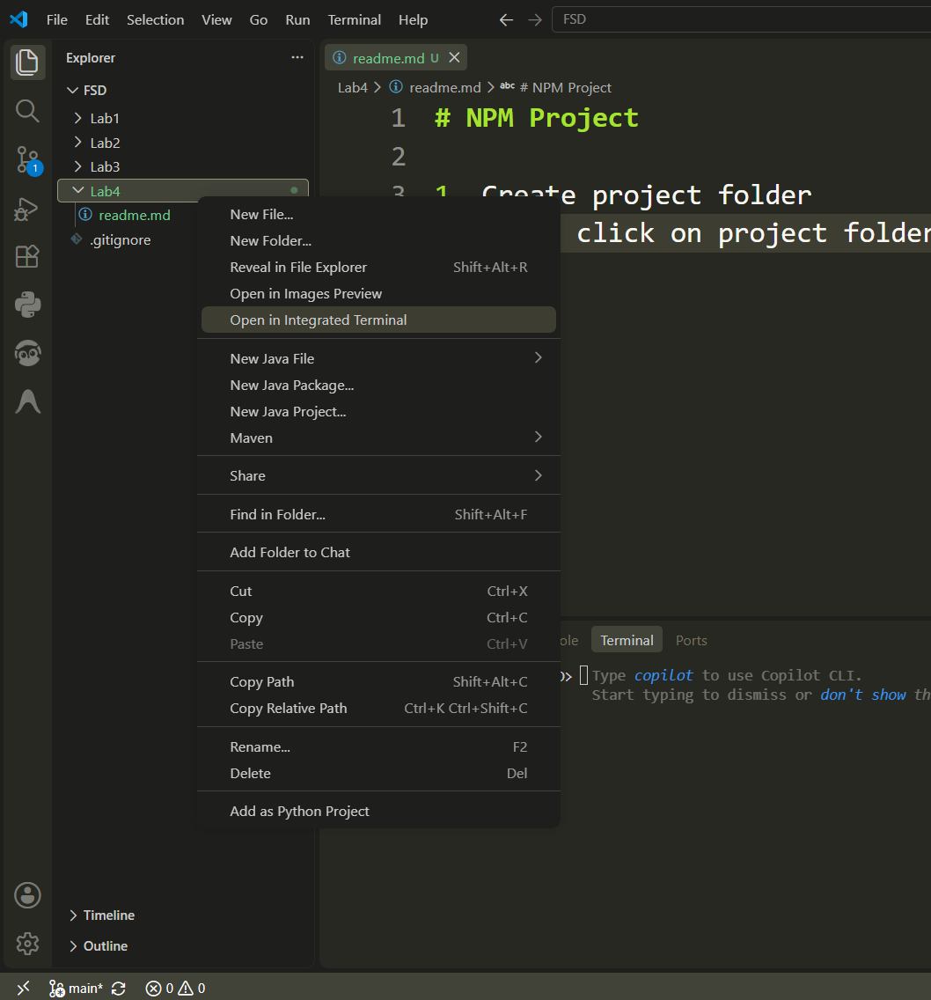
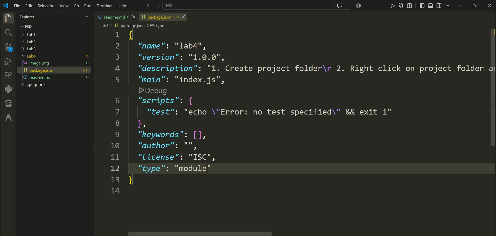
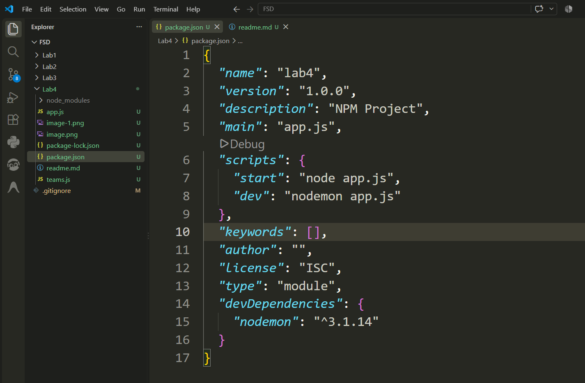

# NPM Project (Lab 4)

## Step 1: Create Project Folder

Create a new project folder.

## Step 2: Open Integrated Terminal

Right-click on the project folder and select **Open in Integrated Terminal**.



## Step 3: Initialize NPM

Run the following command:

```bash
npm init -y
```

## Step 4: Configure `package.json`

Open `package.json` and update:

```json
"type": "module"
```



## Step 5: Install Nodemon

Install nodemon as a development dependency:

```bash
npm i nodemon -D
```

This creates the `node_modules` folder and `package-lock.json`.

## Step 6: Update `.gitignore`

Add the following line:

```text
Lab4/node_modules
```

## Step 7: Update Scripts

Modify the `scripts` section in `package.json`:

```json
"scripts": {
  "start": "node app.js",
  "dev": "nodemon app.js"
}
```



## Step 8: Run the Server

Start the development server:

```bash
npm run dev
```

Server output:

```text
Server is Running on port 5000
```

---

# REST API Endpoints

| Method | Endpoint | Description |
|---------|----------|-------------|
| GET | `/api/v1/teams` | Get all teams |
| GET | `/api/v1/teams/:id` | Get team by ID |
| POST | `/api/v1/teams` | Add a new team |
| PUT | `/api/v1/teams/:id` | Update team |
| DELETE | `/api/v1/teams/:id` | Delete team |

---

# Error Page (404)

If the requested route does not exist, the server returns a **404 Not Found** response.

**Example Request**

```http
GET /api/v1/unknown
```

**Response**

```json
{
  "error": "Route not found"
}
```

---

